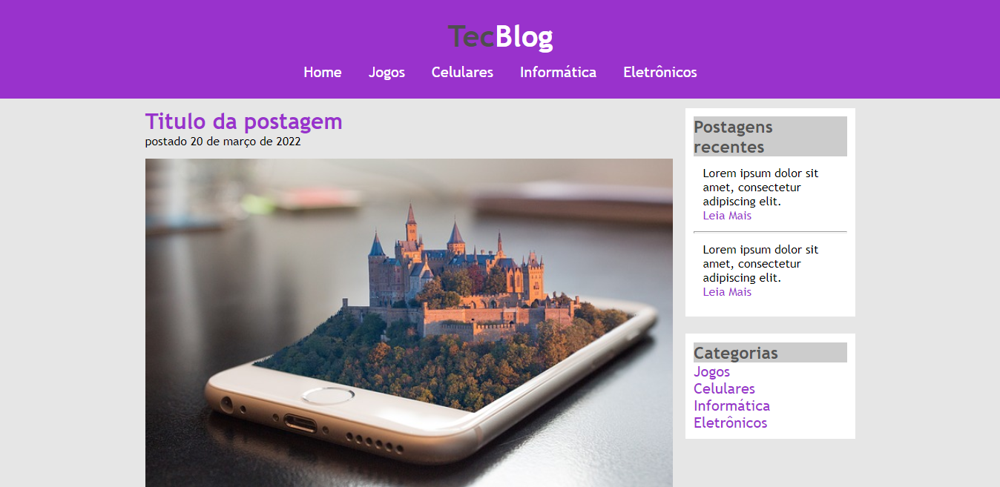
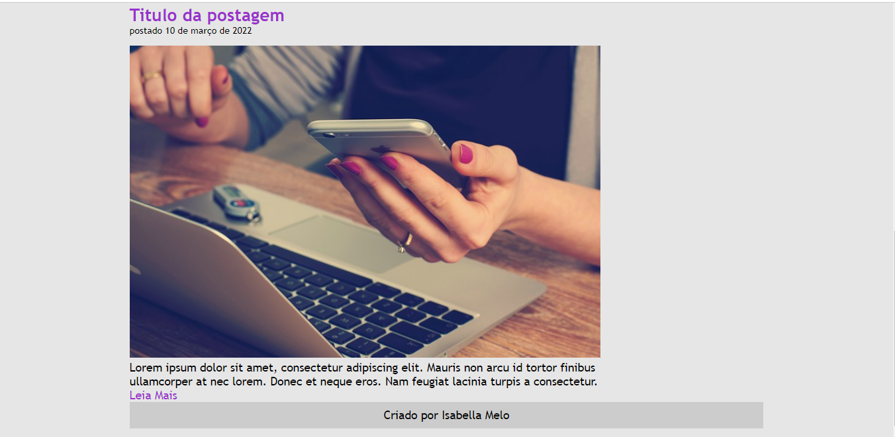

# Projeto TecBlog
Projeto desenvolvido para treinar criação de sites utilizando HTML e CSS.

Clique <a href="https://isabellacpmelo.github.io/TecBlog/">aqui</a> para acessar o projeto.

<a href="https://isabellacpmelo.github.io/TecBlog/"> 

## Ferramentas utilizadas:
- HTML5
- CSS3
  
## Print do Projeto

### Início da Página

### Final da Página

